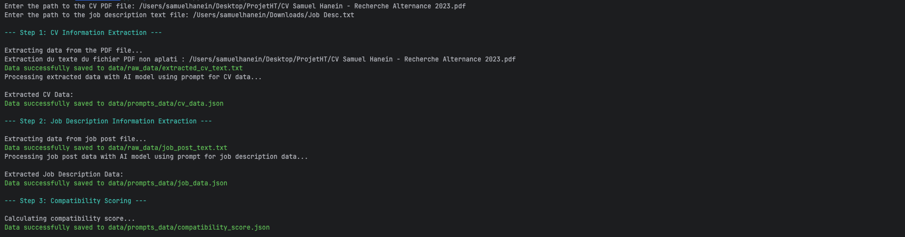

# CVMatcher

CVMatcher est un projet permettant de **récupérer des CV et des offres d’emploi** afin de générer un **score de compatibilité (matchmaking)** entre les deux.  
Le projet utilise le modèle **Mistral** pour effectuer l’analyse et la correspondance.

---

## Fonctionnalités
- Extraction d’informations structurées depuis des CV.
- Extraction d’informations clés depuis des fiches de poste.
- Calcul d’un score de compatibilité entre CV et offres.
- Génération d’un rapport détaillant les correspondances (compétences, expériences, langues, diplômes).

---

## Structure du projet
```
cv_matcher/
│── main.py                # Point d'entrée de l'application
│── environment.yml        # Configuration de l'environnement Conda
│── requirements.txt       # Dépendances Python
│── config/                # Gestion de la configuration et des variables
│── services/              # Logique métier (appel à Mistral, calcul de score, etc.)
│── models/                # Définitions des modèles (CV, offres)
│── utils/                 # Fonctions utilitaires (PDF → texte, JSON, mapping…)
│── prompt/                # Prompts utilisés avec Mistral
```

---

## ⚙️ Installation rapide

### 1. Prérequis
- **Anaconda ou Miniconda** doit être installé sur votre système.  
  👉 [Installer Anaconda](https://www.anaconda.com/download)  
  👉 [Installer Miniconda](https://docs.conda.io/en/latest/miniconda.html)

- Avoir une **clé API Mistral** valide.  
  Créez un fichier `.env` à la racine du projet avec le contenu suivant :

  ```env
  MISTRAL_API_KEY='VotreCléAPI'
  ```

⚠️ Sans ce fichier `.env`, l’application ne fonctionnera pas.

---

### 2. Installation de l’environnement Conda

Depuis la racine du projet `cvmatcher`, exécutez :

```bash
conda env create -f environment.yml
conda activate CvMatcher
```

---

### 3. Lancement de l’application

Toujours depuis la racine du projet :

```bash
python main.py
```
Vous devrez renseigner les liens/chemins du CV (PDF) et de l’offre (fichier texte).

---

## Exemple d’exécution :

Voici un éxemple de l'utilisation de l'app :



Les résultats seront générés et stockés dans le dossier data/ avec les sous-dossiers :
- `prompts_data/` → données préparées pour l’appel aux modèles Mistral 
- `raw_data/` → données brutes récupérées (CV, offres)

---

✍️ Auteur : Samuel Hanein  
📧 Contact : samuelhanein@gmail.com
